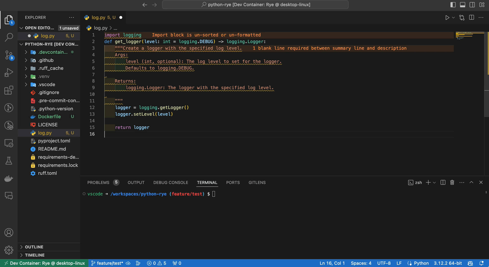

# tg-gemini

`tg-gemini` is a high-performance Python 3.11+ asynchronous middleware service that bridges the **Telegram Bot API** with the **Gemini CLI**. It allows you to use your local Gemini agent (including all its tools, MCP servers, and workspace context) directly from your mobile device via Telegram.



## Key Features

- **Headless CLI Integration:** Communicates with Gemini CLI via `stream-json` NDJSON events.
- **Pure Async Architecture:** Built on `aiogram 3.x` and `asyncio` for non-blocking I/O.
- **Robust Session Management:**
  - `/list` - View all available conversation sessions.
  - `/resume <index|id>` - Resume a specific session or the latest one.
  - `/new [name]` - Start a fresh conversation with an optional custom name.
  - `/delete <index|id>` - Remove sessions from disk directly from Telegram.
- **Real-time Streaming:** Throttled UI updates (1.5s interval) to comply with Telegram rate limits while providing a "live" feel.
- **Tool Status Tracking:** Visual indicators for tool execution (🔧 for running, ✅ for success, ❌ for error).
- **Surgical Markdown-to-HTML:** Converts Markdown to Telegram-compatible HTML, with special support for code blocks and Obsidian callouts.
- **Strict Quality Standards:** 100% test coverage and strict type checking via `ty`.

## Prerequisites

- **Python 3.11+**
- **[uv](https://github.com/astral-sh/uv)** (Recommended package manager)
- **Gemini CLI** installed and configured in your environment.
- A **Telegram Bot Token** from [@BotFather](https://t.me/botfather).

## Installation

```bash
# Clone the repository
git clone https://github.com/atticuszeller/tg-gemini.git
cd tg-gemini

# Sync dependencies using uv
uv sync
```

## Configuration

Create a `config.toml` in the project root:

```toml
[telegram]
bot_token = "YOUR_BOT_TOKEN"
allowed_user_ids = [12345678, 87654321]  # Whitelist for security

[gemini]
model = "auto"  # auto, pro, flash, flash-lite
# approval_mode = "default" # default, auto_edit, yolo
```

## Usage

### Starting the Bot

```bash
uv run tg-gemini start
# or use the provided dev script
bash dev.sh start
```

### Commands

| Command | Description |
| :--- | :--- |
| `/start` | Welcome message and command help. |
| `/new [name]` | Starts a new session. |
| `/list` | Lists all your sessions. |
| `/resume <index\|id>` | Resumes a session by its list index or UUID. |
| `/name <name>` | Sets a custom name for the active session. |
| `/current` | Displays details about the active model and session. |
| `/model <name>` | Switches the model for the current user. |
| `/delete <index\|id>` | Deletes a session from disk. |

## Development

We enforce **100% test coverage** and **strict typing**.

```bash
bash dev.sh format    # Auto-format code
bash dev.sh lint      # Run type checks and lints
bash dev.sh test      # Run tests and check coverage
bash dev.sh check     # Full pre-commit check
```

## Documentation

- [Architecture](docs/architecture.md)
- [Command Mapping](docs/commands.md)
- [Format Conversion](docs/formatting.md)
- [Development Guide](docs/development.md)

## License

MIT
