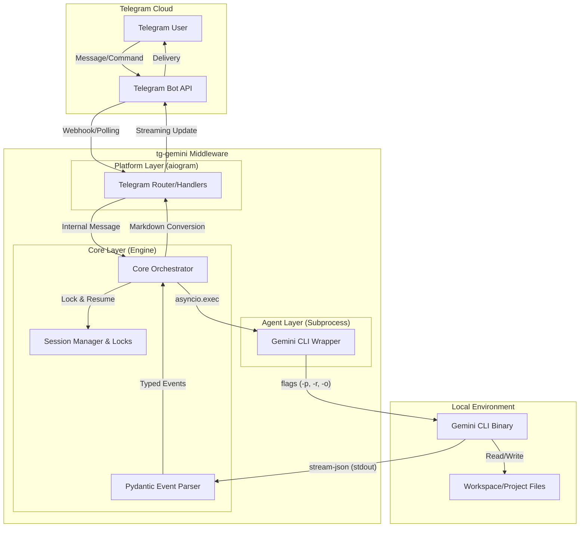

# Architecture

This document details the system design and message processing flow of `tg-gemini`.

## 1. Overview

`tg-gemini` acts as a middle-tier bridge between the **Telegram Bot API** and the **Gemini CLI**. It decouples the messaging platform from the AI agent execution using a modular, asynchronous architecture.

### Architecture Diagram

## 2. Layers

### 2.1 Platform Layer (`tg_gemini.bot`)
- **Framework:** `aiogram 3.x`.
- **Responsibility:** Manages the bot lifecycle, routes incoming updates to handlers, and handles Telegram-specific API calls (sending/editing messages).
- **Tool Display:** Formats tool use events as rich HTML messages with `<pre>` code blocks, bold names, and diff previews. Tool results edit in-place swapping 🔧→✅/❌.
- **Message Ordering:** When tools are used, the initial "Thinking..." is deleted and the final response is sent as a new message after tool messages, preserving chronological order.
- **Security:** Implements user ID filtering based on the `allowed_user_ids` whitelist.

### 2.2 Core Layer (`tg_gemini.bot` — orchestration functions)
- **Orchestration:** The `_process_stream` function coordinates the execution of the agent and the real-time update of the Telegram UI.
- **Session Management:** Tracks user states (active model, session ID) and uses `asyncio.Lock` per user to ensure sequential message processing.
- **Event Validation:** Uses **Pydantic v2** models (`tg_gemini.events`) to strictly validate and parse the `stream-json` output from the Gemini CLI.

### 2.3 Agent Layer (`tg_gemini.gemini`)
- **Execution:** Uses `asyncio.create_subprocess_exec` to launch the Gemini CLI in a non-blocking way with a 10MB stream buffer limit.
- **Streaming:** Reads `stdout` line-by-line, converting the raw NDJSON stream into typed Pydantic events.
- **Continuity:** Automatically handles session resumption using the `--resume` flag and the `session_id` provided in the `init` event.

## 3. Concurrency & Performance

- **Non-blocking I/O:** The entire service is built on `asyncio`.
- **Throttled Updates:** To comply with Telegram API rate limits, UI updates during streaming are throttled based on both time intervals (1.5s) and character count thresholds (200 chars).
- **Scalability:** The state is currently in-memory, designed for personal or small-team use. For high-volume environments, the `SessionManager` can be extended to use a persistent store like Redis.
