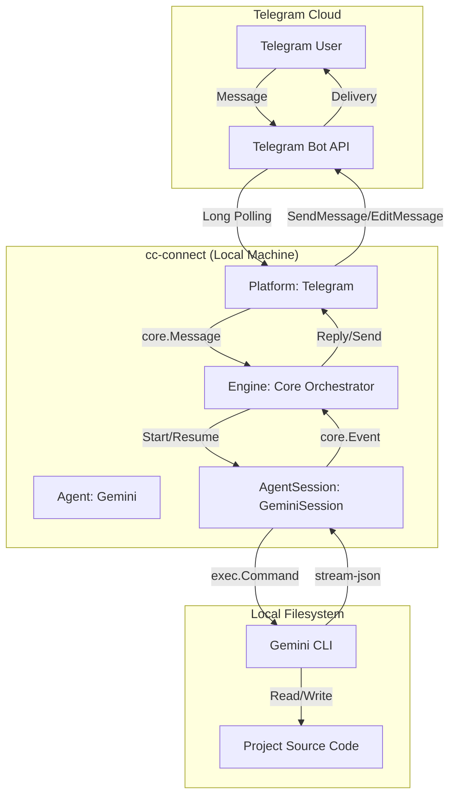

# cc-connect Telegram & Gemini Architecture Design

This document details the architecture and message processing flow of **cc-connect**, specifically focusing on the integration between the **Telegram** platform and the **Gemini** agent.

## 1. Architecture Overview

`cc-connect` acts as a middle-tier bridge. It decouples messaging platforms from AI agents using a plugin-based architecture defined in the `core` package.

### Architecture Diagram

## 2. Message Processing Flow

### 2.1 Receiving (Telegram Platform)
- **Component:** `platform/telegram/telegram.go`
- **Flow:**
    1.  Starts a Long Polling loop (`GetUpdatesChan`).
    2.  Converts Telegram `Update` messages into a unified `core.Message`.
    3.  **Mapping Key (SessionKey):** Generates a unique `SessionKey` formatted as `telegram:{chatID}:{userID}` (or `telegram:{chatID}` if shared session mode is enabled).
    4.  Calls the `handler` (which is `Engine.handleMessage`).

### 2.2 Orchestration (Engine)
- **Component:** `core/engine.go`
- **Flow:**
    1.  **Session Locking:** Uses a `SessionManager` to lock the session, ensuring serial processing for the same user/chat.
    2.  **State Management:** Maintains `interactiveState` which holds the running `AgentSession`.
    3.  **Agent Invocation:** Calls `Agent.StartSession` (passing the `AgentSessionID` if resuming) and then `AgentSession.Send(prompt, images, files)`.

### 2.3 Execution (Gemini Agent)
- **Component:** `agent/gemini/session.go`
- **Flow:**
    1.  `geminiSession.Send` launches the `gemini` CLI binary.
    2.  **Continuity:** Uses the `--resume <session_id>` flag to maintain conversation context within the Gemini CLI.
    3.  **Output Mode:** Uses `--output-format stream-json` to receive structured, real-time events (thinking, tool use, message deltas).
    4.  **Reading:** A background goroutine (`readLoop`) parses stdout as a stream of JSON objects and emits `core.Event` into a channel.

### 2.4 Feedback (Streaming & Final Reply)
- **Component:** `core/engine.go` (`processInteractiveEvents`)
- **Flow:**
    1.  Listens to the `AgentSession.Events()` channel.
    2.  **Streaming:** `EventText` fragments are accumulated. If the platform supports `MessageUpdater` (like Telegram), it can show a "live" preview.
    3.  **Tool Authorization:** If `EventPermissionRequest` occurs, the Engine sends an interactive card/buttons to Telegram and waits for user input.
    4.  **Finalization:** `EventResult` triggers the final message delivery to Telegram.

## 3. Configuration & Mapping

### 3.1 Telegram Configuration
Located in `config.toml` under `[[projects.platforms]]`:
- `token`: Telegram Bot API token.
- `allow_from`: Comma-separated user IDs allowed to interact with the bot (security).
- `proxy`: Optional proxy settings for restricted networks.
- `share_session_in_channel`: If true, all users in a group share the same Gemini session.

### 3.2 Mapping Mechanism
- **Context Preservation:** Gemini CLI's native session ID is stored in the Engine's session store.
- **Bi-directional ID Sync:**
    - When the CLI starts, it provides an ID (`EventInit`).
    - The Engine saves this ID to its local storage.
    - Subsequent messages for the same `SessionKey` use this ID with `--resume`.

## 4. Key Design Principles

1.  **Headless CLI Execution:** The Gemini agent doesn't use an SDK directly; it leverages the pre-existing, tool-rich `gemini` CLI.
2.  **Event-Driven UI:** By streaming JSON from the CLI, the Telegram UI can show "Thinking..." bubbles and interactive tool confirmations.
3.  **Surgical Context Management:** The `SessionKey` ensures that `User A` and `User B` don't leak context to each other unless explicitly configured to share.

---
**Source References:**
- `platform/telegram/telegram.go`
- `agent/gemini/gemini.go`
- `agent/gemini/session.go`
- `core/engine.go`
- `tg-gemini/docs/gemini-cli-reference.md` (CLI command reference)
